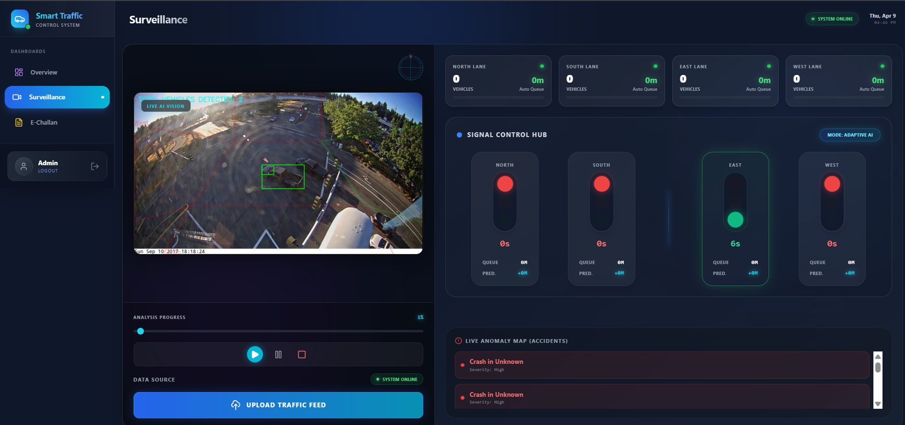
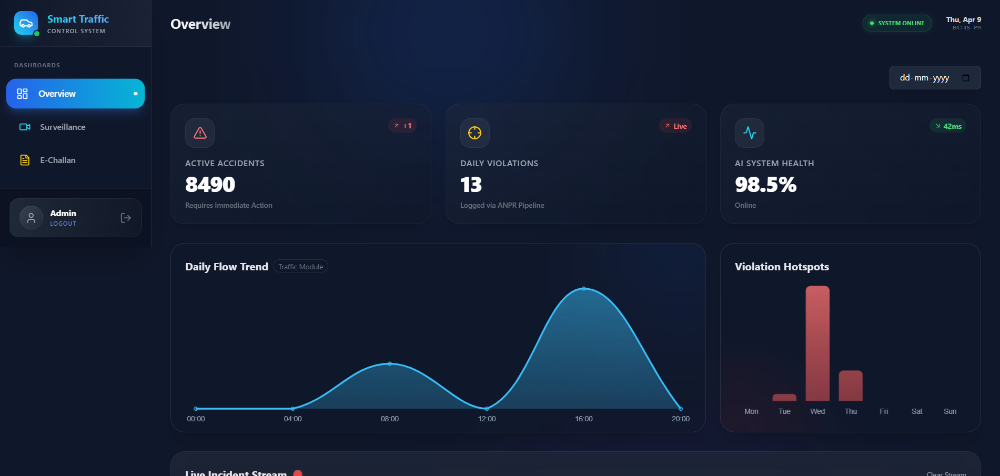

# 🚦 AI-Based Smart Adaptive Traffic Signal Management System

## 📌 Overview

This project presents an intelligent traffic management system that dynamically adjusts traffic signals using AI-based vehicle detection and adaptive control algorithms.

It aims to reduce congestion, waiting time, and improve traffic flow efficiency in urban intersections.

---

## 🚀 Features

* Real-time Vehicle Detection using YOLOv8
* Adaptive Traffic Signal Control
* Automated E-Challan System (Violation Detection)
* Live Monitoring Dashboard
* Traffic Analytics & Insights

---

## 🧠 Tech Stack

* **Frontend:** React.js, Tailwind CSS, Chart.js
* **Backend:** FastAPI, SQLAlchemy
* **ML/CV:** YOLOv8, OpenCV, PyTorch
* **Database:** SQLite

---

## ⚙️ System Architecture

1. Video Input (Camera / Simulation)
2. Vehicle Detection (YOLOv8)
3. Feature Extraction (Count, Queue, Density)
4. Adaptive Signal Logic
5. Violation Detection (Red Light Jump)
6. Dashboard Visualization

---

## 📹 Traffic Video Dataset

Due to GitHub repository size limits, raw traffic video footage is not directly included. You can download the official city dataset used for this project here:
**[City of Bellevue Traffic Video Dataset](https://github.com/City-of-Bellevue/TrafficVideoDataset?tab=readme-ov-file)**

---

## ▶️ Setup & How to Run

### 1. Clone the Repository
```bash
git clone https://github.com/srinivas7075/Smart-Adaptive-Traffic-Signal-Management-System-.git
cd Smart-Adaptive-Traffic-Signal-Management-System-
```

### 2. Backend Setup

```bash
cd backend
python -m venv venv
venv\Scripts\activate      # Windows
# source venv/bin/activate # Mac/Linux
pip install -r requirements.txt
uvicorn main:app --reload
```

### 3. Frontend Setup

Open a new terminal window:
```bash
cd frontend
npm install
npm run dev
```

---

## 📊 Modules

* Surveillance (Live Detection)
* Traffic Signal Control
* E-Challan System
* Analytics Dashboard

---

## 📸 Demo

### Surveillance System (Live Vision)


### Dashboard Overview


---

## 🎯 Future Improvements

* Multi-intersection optimization
* Reinforcement Learning-based control
* Real-time camera integration

---


